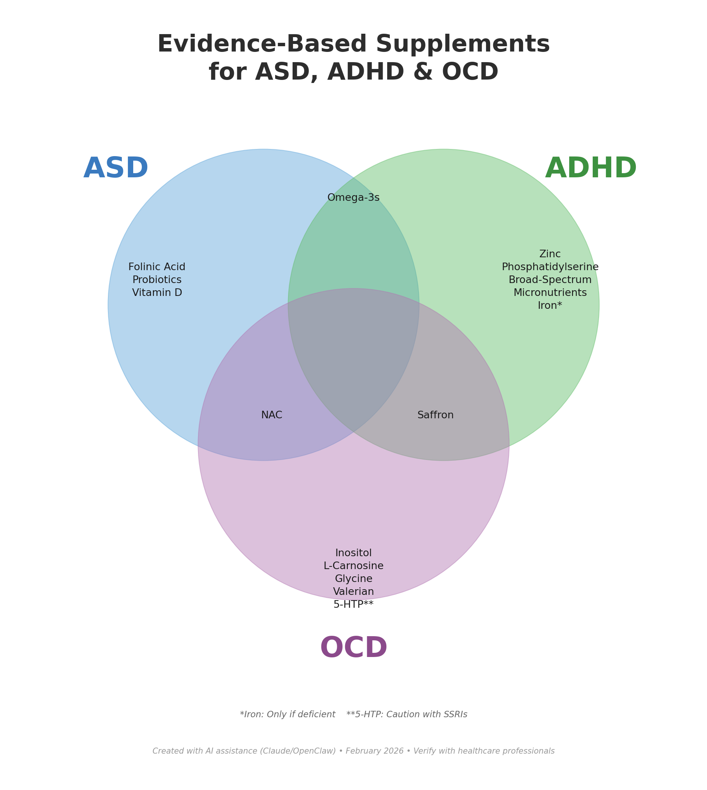

# Evidence-Based Supplements for ASD, ADHD & OCD

A comprehensive research synthesis analyzing peer-reviewed clinical trials and meta-analyses on nutritional and herbal interventions for Autism Spectrum Disorder, ADHD, and Obsessive-Compulsive Disorder.

## 🎯 Project Overview

This project compiles and analyzes evidence from randomized controlled trials (RCTs), meta-analyses, and systematic reviews to identify supplements with meaningful clinical evidence for neurodevelopmental and psychiatric conditions.

**Key Question:** Which supplements have genuine scientific support for ASD, ADHD, and OCD — and how can they be combined strategically?

## 📊 Key Findings

### Cross-Condition Analysis

| Supplement | ASD | ADHD | OCD | Evidence Level |
|------------|:---:|:----:|:---:|----------------|
| **Omega-3s (EPA+DHA)** | ✓ | ✓ | — | Strong |
| **Saffron** | — | ✓ | ✓ | Moderate |
| **NAC** | ✓ | — | ✓ | Moderate |
| **Zinc** | — | ✓ | — | Moderate (if deficient) |
| **Iron** | — | ✓ | — | Moderate (if deficient) |
| **Phosphatidylserine** | — | ✓ | — | Moderate |
| **Probiotics** | ✓ | — | — | Moderate |
| **Folinic Acid** | ✓* | — | — | Moderate |
| **Vitamin D** | ✓ | — | — | Moderate |

*For individuals with Folate Receptor Autoantibodies (FRAAs)

### Top Evidence-Based Interventions

**For ADHD:**
- Omega-3 fatty acids showed modest but consistent improvements in hyperactivity and inattention (PMID: 25181335)
- Zinc as adjunct to stimulants reduced medication dose needed by 37% (PMID: 21309695)
- Saffron performed equivalently to methylphenidate in a 6-week RCT (PMID: 30741567)

**For ASD:**
- Multi-strain probiotics improved overall behavioral symptoms (PMID: 39702309)
- NAC reduced irritability (PMID: 34793863)
- Vitamin D improved stereotypical behaviors (PMID: 37119216)

**For OCD:**
- Saffron showed comparable efficacy to SSRIs for mild-moderate OCD
- NAC is the most-studied supplement with modest benefit trends

## 📁 Project Contents

| File | Description |
|------|-------------|
| `supplements-asd-adhd-report.md` | Main evidence report with dosages and citations |
| `synergistic-supplement-protocol.md` | Practical protocol combining supplements strategically |
| `OCD_Supplements_Research_Report.md` | Detailed OCD-specific research |
| `herbal-remedies-adhd-autism-2026.md` | Herbal/botanical interventions analysis |
| `supplements-venn-diagram.png` | Visual showing condition overlaps |

## 🔬 Methodology

1. **Literature Search:** PubMed, Cochrane Library, major medical journals
2. **Inclusion Criteria:** Randomized controlled trials, meta-analyses, systematic reviews
3. **Evidence Grading:** Categorized by strength of evidence (Strong → Moderate → Preliminary → Inconclusive)
4. **Citation:** All findings include PMID references for verification

## 💡 Novel Contribution: Synergistic Protocol

Beyond reviewing individual supplements, this project identifies **synergistic combinations** based on biochemical mechanisms:

- **PS + Omega-3s:** Enhanced membrane function (structure + fluidity)
- **Zinc + B6:** Cofactors for neurotransmitter synthesis
- **NAC + Glycine:** Glutathione precursors (up to 200% increase)
- **Iron + Vitamin C:** 3x improved iron absorption

See `synergistic-supplement-protocol.md` for the complete tiered protocol.

## ⚠️ Important Notes

- **This is not medical advice.** Always consult healthcare providers before starting supplements.
- **Test for deficiencies first:** Iron, zinc, vitamin D, and FRAAs should be tested before supplementing.
- **Supplements are adjunctive:** They complement, not replace, conventional treatments.
- **Individual variation is significant:** What works for one person may not work for another.

## 📚 Key References

| PMID | Study Focus |
|------|-------------|
| [25181335](https://pubmed.ncbi.nlm.nih.gov/25181335/) | Omega-3 meta-analysis for ADHD |
| [21309695](https://pubmed.ncbi.nlm.nih.gov/21309695/) | Zinc as stimulant adjunct |
| [30741567](https://pubmed.ncbi.nlm.nih.gov/30741567/) | Saffron vs methylphenidate |
| [39702309](https://pubmed.ncbi.nlm.nih.gov/39702309/) | Probiotics for ASD behaviors |
| [34793863](https://pubmed.ncbi.nlm.nih.gov/34793863/) | NAC for ASD irritability |
| [37119216](https://pubmed.ncbi.nlm.nih.gov/37119216/) | Vitamin D for ASD |
| [33539192](https://pubmed.ncbi.nlm.nih.gov/33539192/) | Phosphatidylserine for ADHD |
| [28967099](https://pubmed.ncbi.nlm.nih.gov/28967099/) | Broad-spectrum micronutrients |

## 🛠️ Tools Used

- Literature review and synthesis
- Evidence grading methodology
- Data visualization (Venn diagram)
- Protocol development

## 📄 License

This research compilation is provided for educational purposes. All cited studies are publicly available through PubMed.

---

*Research compiled: February 2026*
